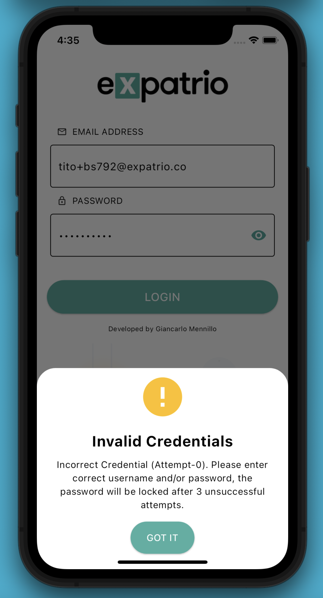
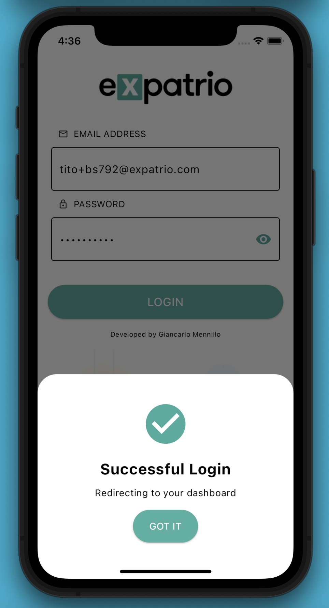
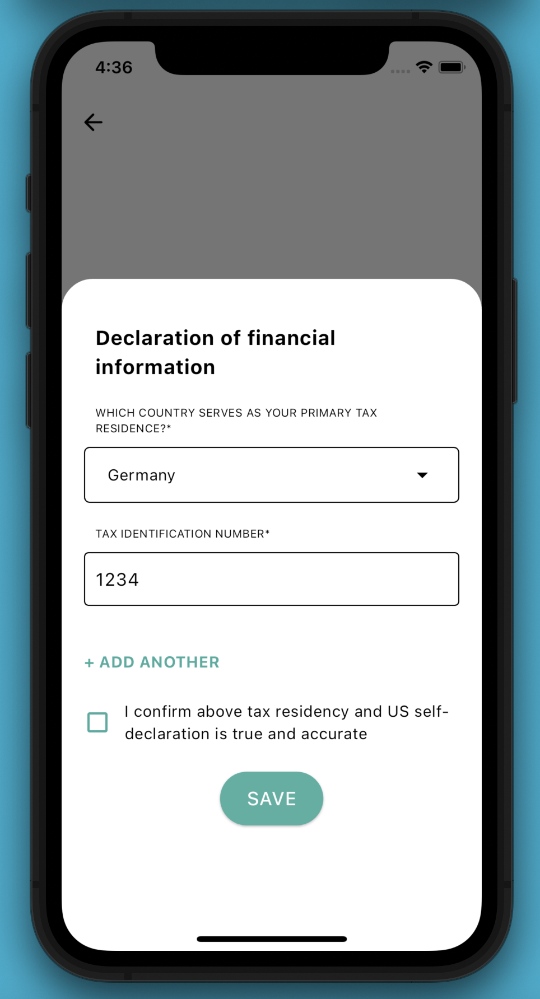
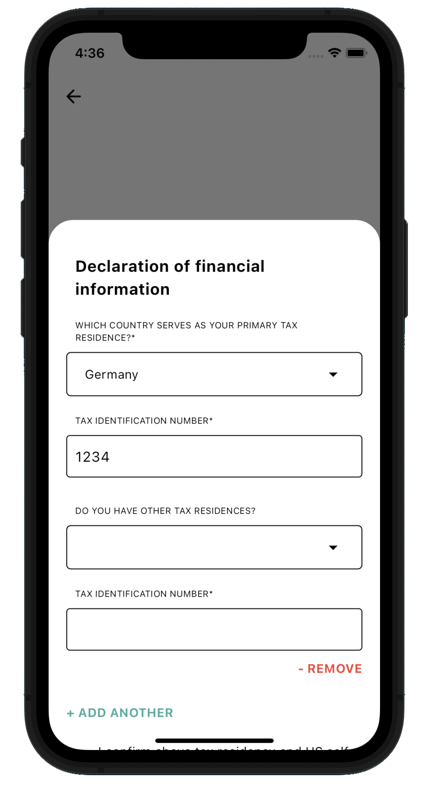
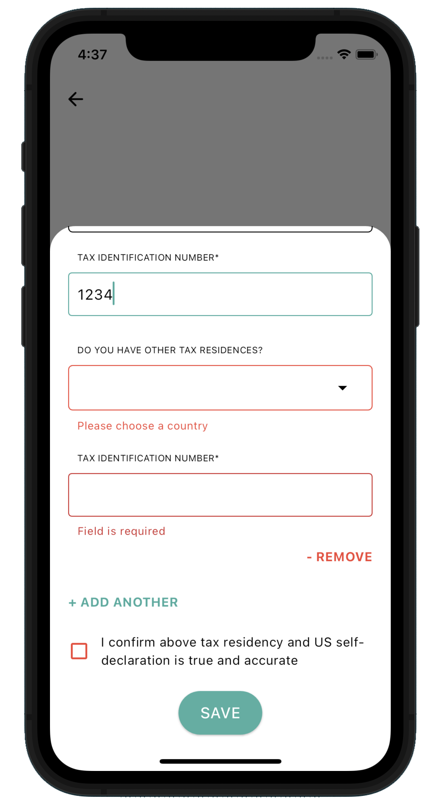

# Expatrio Tax Data Management App

## Overview

Welcome to the Expatrio Tax Data Management App! This Flutter application is designed to streamline the process of managing tax residency information for users. It encompasses a set of features including a user-friendly login page, a dedicated screen with a prominent Call-to-Action (CTA) for updating tax data, and a convenient bottom sheet for seamless input and editing of tax-related information.

## Screenshots

  
  
  
  

## Features

1. **Login Screen**: A secure login page  (with Expatrio authentication) that ensures users can access their tax-related information with confidence.
2. **Tax Data Screen**: After a successful login, the user is redirect in the Tax Data Screen, a screen with a prominent CTA to update his TAX DATA.  When the user clicks on the "UPDATE YOUR TAX DATA" button, a bottom sheet open, prompting the user to input their tax data.
3. **Tax Form Widget**: A flexible widget that facilitates the input of tax residency information, allowing users to efficiently manage their primary and secondary tax residences. 
   - Via API call  data is received  and to pre-populate existing fields. Here the user can select a country from a list and also allow the user to input a TAX ID number for the field. A user can select multiple taxation countries by clicking the "ADD ANOTHER" button. 
   - A verification is applied so that the user is not able to choose a previously selected country.
   - The user can also remove any additional countries by clicking on the "REMOVE" button. A verification is made so that by default, the user must have at least one country/tax pair available.
   - The user is forced to check a checkbox verifying the accuracy of their information before being able to submit their tax data.
   - The tax data is stored locally for the user’s ID and pushed to the backend via API call.
4. **Country Dropdown Widget**: A reusable widget for searching and selecting countries, ensuring a standardized and user-friendly approach across the application.
5. **Search Box Widget**: A search box that enhances the user's ability to find specific information quickly, improving overall usability.

## Technologies Used

- **Flutter**: A powerful UI toolkit for building natively compiled applications for mobile, web, and desktop from a single codebase.
- **Lottie**: An animation library for Flutter that enables the use of After Effects animations in the app.
- **URL Launcher**: A Flutter plugin for launching URLs, providing a convenient way to open links in the default web browser.
- **HTTP**: A Dart package for making HTTP requests, facilitating communication with remote APIs.
- **Flutter Secure Storage**: A Flutter plugin for securely storing key-value pairs, ensuring sensitive data is stored safely.
- **Flutter SVG**: A Flutter plugin for rendering SVG images, offering scalable and resolution-independent graphics.
- **Flutter Lints**: A set of recommended lint rules for Flutter projects, ensuring good coding practices.
- **Flutter Test**: The Flutter testing package for writing unit and widget tests, ensuring the reliability of the codebase.
- **Flutter Shake My Widget**: A Flutter package for adding shake animations to widgets, enhancing the user interface with visual feedback.
- **Path**: A Dart package providing common operations for manipulating file paths.

This project follows the best practices and coding standards outlined by the lint rules, ensuring clean, maintainable, and efficient code.

## Folder Structure

The project is organized following best practices to enhance maintainability and readability:

- **lib/src/screens**: Contains screen implementations (e.g., `login.dart`, `tax_data_screen.dart`).
- **lib/widgets**: Holds various reusable widgets used across the application (e.g., `country_dropdown.dart`, `search_box.dart`).
- **lib/models**: Houses data models (e.g., `tax_residence.dart`, `item_dropdown.dart`).
- **lib/services**: Includes service classes responsible for handling data retrieval and manipulation (e.g., `tax_data_service.dart`).
- **lib/shared**: Consists of shared constants and configurations (e.g., `constants.dart`, `countries_constants.dart`).
- **lib/main.dart**: The entry point of the application.

## Responsiveness

The app is designed to work seamlessly across various screen sizes, providing a consistent and enjoyable experience on both small and large devices.

## Getting Started

Follow these steps to run the application locally:

1. Clone this repository to your local machine.

    ```bash
    git clone https://github.com/GianMen91/expatrio_coding_challenge.git

    ```

2. Navigate to the project directory.

    ```bash
    cd expatrio_coding_challenge
    ```

3. Run the application.

    ```bash
    flutter run
    ```

### Potential Improvements

1. **Localization**: Implement localization to support multiple languages.
2. **Testing**: Add more tests for robust and reliable code.
3. **Error Handling**: Strengthen error handling mechanisms to provide users with meaningful feedback in case of unexpected scenarios.
4. **Firebase Integration**: Explore integrating tools like Crashlytics for proactive crash reporting and real-time monitoring, enhancing overall app stability and user experience.

